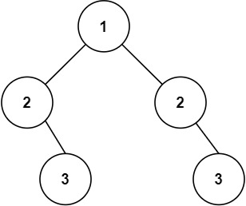

## 题目

[101. 对称二叉树](https://leetcode.cn/problems/symmetric-tree/)

给你一个二叉树的根节点 `root` ， 检查它是否轴对称。

 

**示例 1：**


```
输入：root = [1,2,2,3,4,4,3]
输出：true
```

**示例 2：**



```
输入：root = [1,2,2,null,3,null,3]
输出：false
```

 

**提示：**

- 树中节点数目在范围 `[1, 1000]` 内
- `-100 <= Node.val <= 100`


## 代码

```java
/**
 * Definition for a binary tree node.
 * public class TreeNode {
 *     int val;
 *     TreeNode left;
 *     TreeNode right;
 *     TreeNode() {}
 *     TreeNode(int val) { this.val = val; }
 *     TreeNode(int val, TreeNode left, TreeNode right) {
 *         this.val = val;
 *         this.left = left;
 *         this.right = right;
 *     }
 * }
 */
class Solution {
    public boolean isSymmetric(TreeNode root) {
        if(root==null) return true;
        return isSame(root.left,root.right);
    }

    private boolean isSame(TreeNode left,TreeNode right){
        if(left==null && right==null) return true;
        if(left==null || right==null) return false;
        if(left.val != right.val) return false;
        return isSame(left.left,right.right) && isSame(left.right,right.left);
    }
}
```

递归操作 , 从对称的两棵子树进行比较, 然后递归每一个样例