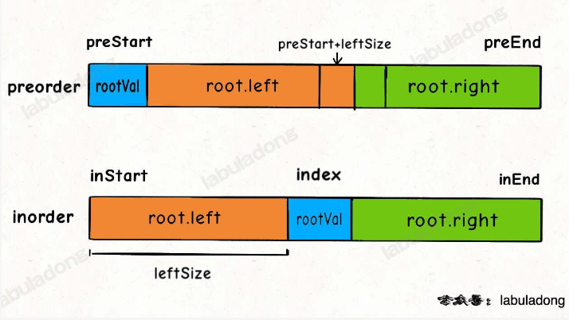

## 题目

[105. 从前序与中序遍历序列构造二叉树](https://leetcode.cn/problems/construct-binary-tree-from-preorder-and-inorder-traversal/)

给定两个整数数组 `preorder` 和 `inorder` ，其中 `preorder` 是二叉树的**先序遍历**， `inorder` 是同一棵树的**中序遍历**，请构造二叉树并返回其根节点。

 

**示例 1:**


```
输入: preorder = [3,9,20,15,7], inorder = [9,3,15,20,7]
输出: [3,9,20,null,null,15,7]
```

**示例 2:**

```
输入: preorder = [-1], inorder = [-1]
输出: [-1]
```

 

**提示:**

- `1 <= preorder.length <= 3000`
- `inorder.length == preorder.length`
- `-3000 <= preorder[i], inorder[i] <= 3000`
- `preorder` 和 `inorder` 均 **无重复** 元素
- `inorder` 均出现在 `preorder`
- `preorder` **保证** 为二叉树的前序遍历序列
- `inorder` **保证** 为二叉树的中序遍历序列

## 代码

```java
class Solution {
    // 根左右
    // 左跟右
    Map<Integer,Integer> val2Idx;
    public TreeNode buildTree(int[] preorder, int[] inorder) {
        val2Idx= new HashMap();
        for(int i=0;i<inorder.length;i++){
            val2Idx.put(inorder[i],i);
        }
        return build(preorder,inorder,0,preorder.length-1,0,inorder.length-1);
    }

    // 闭区间
    // 通过中序遍历以及下标知道字数的大小, 然后在preorder中确定子树的范围
    private TreeNode build(int[] preorder, int[] inorder,int i,int j,int s,int e){
        if(i>j) return null;
        TreeNode root = new TreeNode(preorder[i]);
        int mid = val2Idx.get(root.val);
        int lSize = mid - s;
        root.left=build(preorder,inorder,i+1,i+lSize, s,mid-1);
        root.right=build(preorder,inorder, i+lSize+1,j , mid+1,e);
        return root;
    }
}
```

## 思路

我们思考前序 , 中序遍历的逻辑(根左右, 左跟右)

比如题目给出的样例 : 

` preorder = [3,9,20,15,7], inorder = [9,3,15,20,7]`



通过上图不难发现  . 我们先通过先序遍历(preorder[0])找到根节点 , 然后通过inorder ,可以得出 左右子树的长度(节点个数) , 

然后再去preorder中找到左子树对应的区间

- 左子树: `[rootIdx +1, rootIdx+leftSize]`
- 右子树 : `[rootIdx+leftSize +1, j]`

按照先序遍历的规则 , 依次构建出根节点 左右子树 , 最后返回即可

> 这里通过 map 来存储 节点在inorder中对应的下标 , **可以帮助快速计算子树的长度**