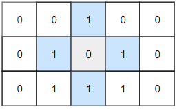

## 题目

[1254. 统计封闭岛屿的数目](https://leetcode.cn/problems/number-of-closed-islands/)

二维矩阵 `grid` 由 `0` （土地）和 `1` （水）组成。岛是由最大的4个方向连通的 `0` 组成的群，封闭岛是一个 `完全` 由1包围（左、上、右、下）的岛。

请返回 *封闭岛屿* 的数目。

 

**示例 1：**


```
输入：grid = [[1,1,1,1,1,1,1,0],[1,0,0,0,0,1,1,0],[1,0,1,0,1,1,1,0],[1,0,0,0,0,1,0,1],[1,1,1,1,1,1,1,0]]
输出：2
解释：
灰色区域的岛屿是封闭岛屿，因为这座岛屿完全被水域包围（即被 1 区域包围）。
```

**示例 2：**



```
输入：grid = [[0,0,1,0,0],[0,1,0,1,0],[0,1,1,1,0]]
输出：1
```

**示例 3：**

```
输入：grid = [[1,1,1,1,1,1,1],
             [1,0,0,0,0,0,1],
             [1,0,1,1,1,0,1],
             [1,0,1,0,1,0,1],
             [1,0,1,1,1,0,1],
             [1,0,0,0,0,0,1],
             [1,1,1,1,1,1,1]]
输出：2
```

 

**提示：**

- `1 <= grid.length, grid[0].length <= 100`
- `0 <= grid[i][j] <=1`

## 代码

```java
class Solution {
    int[][] g;
    int res = 0;
    int m, n;

    public int closedIsland(int[][] grid) {
        this.g = grid;
        this.m = g.length;
        this.n = g[0].length;
        for (int j = 0; j < n; j++) {
            // 把靠上边的岛屿淹掉
            dfs(0, j);
            // 把靠下边的岛屿淹掉
            dfs(m - 1, j);
        }
        for (int i = 0; i < m; i++) {
            // 把靠左边的岛屿淹掉
            dfs(i, 0);
            // 把靠右边的岛屿淹掉
            dfs(i, n - 1);
        }
        for (int i = 0; i < m; i++) {
            for (int j = 0; j < n; j++) {
                if (g[i][j] == 0) {
                    res++;
                    dfs(i, j);
                }
            }
        }
        return res;
    }

    void dfs(int i, int j) {
        // 越界
        if (i < 0 || j < 0 || i == m || j == n) {
            return ;
        }
        if (g[i][j] == 1) return ;
        g[i][j] = 1;
        dfs(i + 1, j);
        dfs(i, j + 1);
        dfs(i - 1, j);
        dfs(i, j - 1);
    }
}
```


## 思路

首先一定要注意题目的要求 **: 封闭岛是一个 `完全` 由1包围（左、上、右、下）的岛。**

也就是说 边界的 格子,  始终都不会满足是封闭的岛屿 

我们每次统计岛屿的时候 , 都把当前的岛屿 "淹没" (保证一个岛屿只计算一次)   , 当一个岛屿四周都是 水 的时候,  也就是 **独立岛屿**  了 

每次统计完 都把 当前统计的岛屿联通 的 陆地 "淹没"  , 确保其他的 土地 的独立

---

写的时候我们可以知道 , **如果某个土地与 边界上的土地 联通** ,  那么这个 土地 不会满足独立岛屿的条件 , <u>因此我们可以先淹没 这些 土地</u>

```java
for (int j = 0; j < n; j++) {
    // 把靠上边的岛屿淹掉
    dfs(0, j);
    // 把靠下边的岛屿淹掉
    dfs(m - 1, j);
}
for (int i = 0; i < m; i++) {
    // 把靠左边的岛屿淹掉
    dfs(i, 0);
    // 把靠右边的岛屿淹掉
    dfs(i, n - 1);
}
```

接着我们只需要统计 还是 土地的格子就可以了 (记得**通过淹没** 来 标记这些 统计过的格子)

