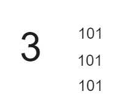

## 题目

[137. 只出现一次的数字 II](https://leetcode.cn/problems/single-number-ii/)

给你一个整数数组 `nums` ，除某个元素仅出现 **一次** 外，其余每个元素都恰出现 **三次 。**请你找出并返回那个只出现了一次的元素。

你必须设计并实现线性时间复杂度的算法且使用常数级空间来解决此问题。

**示例 1：**

```
输入：nums = [2,2,3,2]
输出：3
```

**示例 2：**

```
输入：nums = [0,1,0,1,0,1,99]
输出：9
```

**提示：**

- `1 <= nums.length <= 3 * 104`
- `-231 <= nums[i] <= 231 - 1`
- `nums` 中，除某个元素仅出现 **一次** 外，其余每个元素都恰出现 **三次**

## 代码

假定一个元素出现了 3 次, 例如 4, 那么我们取出这个元素的 二进制表达, 其中的每一位必然也是 出现三次 

0100

0100

0100

题目给出的元素大小是有限的, 因此可以通过变量来存储 这些出现的位数的次数, 

```go
func singleNumber(nums []int)int{
    n:=0
    for i:=0;i<32;i++{
        cur :=0
        // 计算从右数第i+1位
        for _,val:=range nums{
			cur += val>>i & 1
        }
        n |= cur%3 << i
    }
    return n
}
```

:bulb:注意! 

上面的代码在计算的时候 , 由于val 在64位OS下是 8byte, 由于 负数的补码的1在第一位, 因此这里的循环使用的是 64 次的循环, 会导致无法取到前面补码的1(符号位), 导致在计算的时候出现异常, 解决办法就是将循环的次数由32 变为 64

>  或者在计算的时候统一转换为 int32, 不过在返回的时候需要转换过来

```go
func singleNumber(nums []int)int{
    n:=0
    for i:=0;i<64;i++{
        cur :=0
        // 计算从右数第i+1位
        for _,val:=range nums{
            cur += val>>i & 1
        }
        n |= cur%3 << i
    }
    return n
}
```


**排序**

```java
class Solution {
    public int singleNumber(int[] nums) {
        Arrays.sort(nums);
        int idx=0;
        while(idx<nums.length-1){
            int cur = nums[idx++];
            if(cur!=nums[idx]){
                return cur;
            }
            idx+=2;
        }
        return nums[nums.length-1];
    }
}
```

**位运算**

```java
class Solution {
    public int singleNumber(int[] nums) {
        // forEach 3
        int res=0;
        for(int i=0;i<32;i++){
            int total = 0;
            for(int num: nums){
                num>>=i;
                total += num&1; 
            }
            if(total%3!=0){
                res+=(1<<i);
            }
        }
        return res;
    }
}
```

## 思路

### 排序

对原数组进行排序 , 每次遍历三个元素 , 在遍历的时候进行判断,  如果每三个元素的第一个与第二个不同,  **那么这第一个元素就是只出现一次的元素**

### 位运算

对于同样的三个元素 , 这个元素的每一位一定是三的倍数

比如: 



我们数组中每一位的元素都求和 ,  %3 即可得出只出现一次的元素在这一位的值(二进制位)是否为1 , 如果为1 我们就加上即可

`|` or`+`均可

