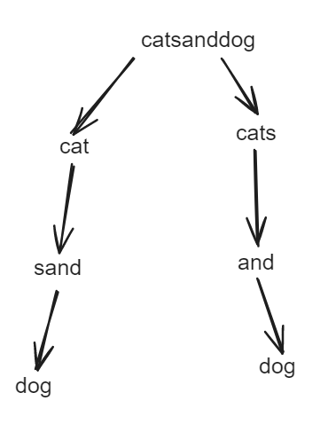

## 题目

[140. 单词拆分 II](https://leetcode.cn/problems/word-break-ii/)

给定一个字符串 `s` 和一个字符串字典 `wordDict` ，在字符串 `s` 中增加空格来构建一个句子，使得句子中所有的单词都在词典中。**以任意顺序** 返回所有这些可能的句子。

**注意：**词典中的同一个单词可能在分段中被重复使用多次。

 

**示例 1：**

```
输入:s = "catsanddog", wordDict = ["cat","cats","and","sand","dog"]
输出:["cats and dog","cat sand dog"]
```

**示例 2：**

```
输入:s = "pineapplepenapple", wordDict = ["apple","pen","applepen","pine","pineapple"]
输出:["pine apple pen apple","pineapple pen apple","pine applepen apple"]
解释: 注意你可以重复使用字典中的单词。
```

**示例 3：**

```
输入:s = "catsandog", wordDict = ["cats","dog","sand","and","cat"]
输出:[]
```

 

**提示：**


- `1 <= s.length <= 20`
- `1 <= wordDict.length <= 1000`
- `1 <= wordDict[i].length <= 10`
- `s` 和 `wordDict[i]` 仅有小写英文字母组成
- `wordDict` 中所有字符串都 **不同**

## 代码

```java
class Solution {
    List<String> res = new ArrayList();
    StringBuilder sb = new StringBuilder();
    public List<String> wordBreak(String s, List<String> wordDict) {
        traverse(s,0,wordDict);
        return res;
    }
    private void traverse(String s, int idx, List<String> wordDict){
        if(idx >= s.length()){
            // 去除末尾的空格
            res.add(sb.deleteCharAt(sb.length()-1).toString());
            return ;
        }
        String str = s.substring(idx);
        for(String word : wordDict){
            if(str.startsWith(word)){
                int preL = sb.length();
                sb.append(word).append(" ");
                traverse(s,idx+word.length(),wordDict);
                sb.delete(preL,sb.length());
            }
        }
    }
}
```

## 思路

**回溯**

回溯字符串, 如果匹配word 那么就继续进行之后的字符串的匹配

相当于 : 



这里需要熟悉StringBuilder的API

`delete(int start, int end)` 删除区间元素

`deleteCharAt(int index) `  删除指定位置的元素

同时需要注意末尾的空格。