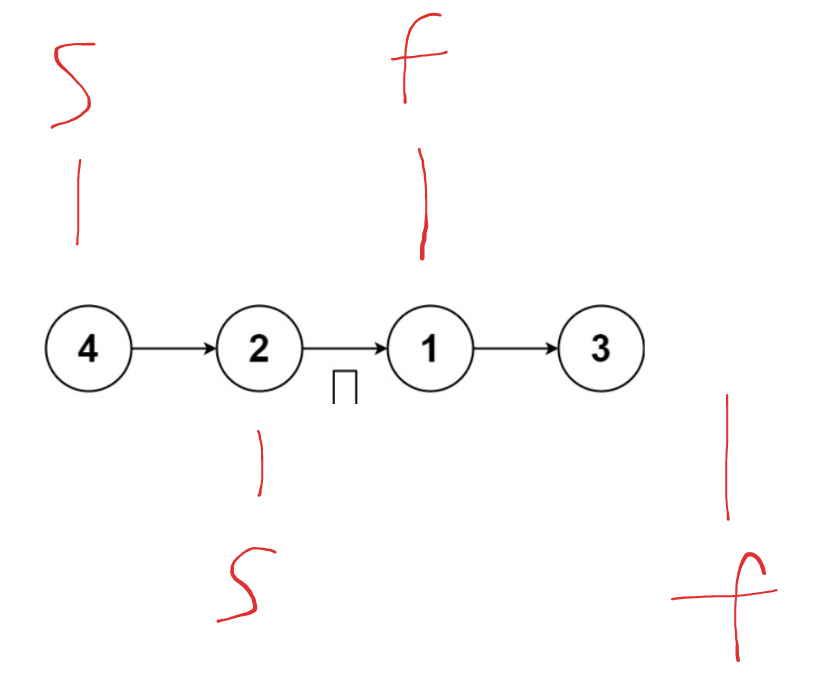
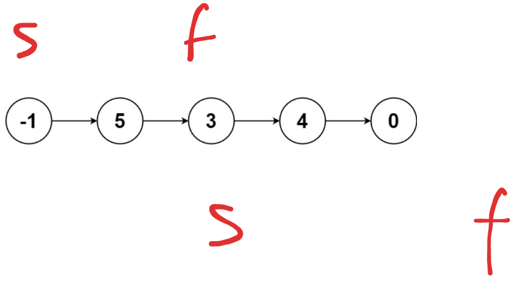

## 题目

[148. 排序链表](https://leetcode.cn/problems/sort-list/)

给你链表的头结点 `head` ，请将其按 **升序** 排列并返回 **排序后的链表** 。


**示例 1：**


```
输入：head = [4,2,1,3]
输出：[1,2,3,4]
```

**示例 2：**


```
输入：head = [-1,5,3,4,0]
输出：[-1,0,3,4,5]
```

**示例 3：**

```
输入：head = []
输出：[]
```

 

**提示：**

- 链表中节点的数目在范围 `[0, 5 * 104]` 内
- `-105 <= Node.val <= 105`

## 代码

```java
class Solution {
    public ListNode sortList(ListNode head) {
       return mergeSort(head);
    }
    // 归并排序
    // 快慢指针, 分割链表
    // 对链表进行排序并反转头结点
    private ListNode mergeSort(ListNode head){
        if(head==null || head.next == null){
            return head;
        }
        var f= head.next.next;
        var s= head;
        while(f!=null && f.next!=null){
            f=f.next.next;
            s=s.next;
        }
        // 分别排序左右两部分
        var rHead= mergeSort(s.next);
        // 断开连接
        s.next = null;
        var lHead = mergeSort(head);
        return merge(lHead,rHead);
    }

    private ListNode merge(ListNode s,ListNode f){
        if(s==null) return f;
        if(f==null) return s;
        ListNode cur=new ListNode(-1);
        var res = cur;
        while(s!=null && f!=null){
            if(s.val<f.val){
                cur.next = s;
                s=s.next;
            }else{
                cur.next = f;
                f=f.next;
            }
            cur = cur.next;
        }
        cur.next = s==null? f:s;
        return res.next;
    }
}
```

## 思路

对链表进行排序, 可以采用归并排序的做法

核心的思想是: 

1. 分治
2. 合并

对于链表我们是无法提前知道长度的, 不过可以利用快慢指针的做法,  将链表分成两个部分,

例如

```java
var s = head;
// 注意这里的f 需要提前走两步
var f = head.next.next;
while(f!=null && f.next!=null){
    s=s.next;
    f=f.next.next;
}
```

对于 偶数个节点的链表, 此时的指向应该是 



<u>对于奇数个节点的链表则是</u> 



如果我们**没有让f提前走两步**, 那么s会指向 **右半部分链表的头结点**

但是后续我们需要把链表断开排序, 再次合并, 因此这里需要让s位于 左边链表的最后一个节点中 , 方便进行后续的操作

```java
var rHead = mergeSort(s.next);
// 断开两部分的链表
s.next=null; 
var lHead = mergeSort(head);
// 排序完成之后, 进行链表的合并
merge(lHead , rHead);
```


 