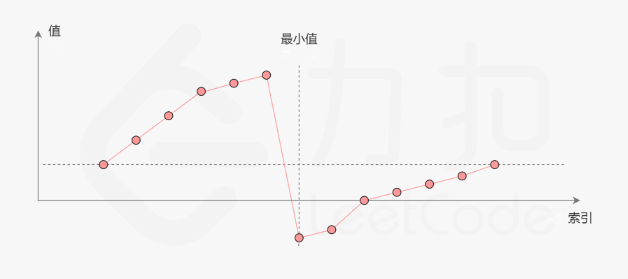

## 题目

[153. 寻找旋转排序数组中的最小值](https://leetcode.cn/problems/find-minimum-in-rotated-sorted-array/)

已解答

中等


相关标签

相关企业


提示


已知一个长度为 `n` 的数组，预先按照升序排列，经由 `1` 到 `n` 次 **旋转** 后，得到输入数组。例如，原数组 `nums = [0,1,2,4,5,6,7]` 在变化后可能得到：

- 若旋转 `4` 次，则可以得到 `[4,5,6,7,0,1,2]`
- 若旋转 `7` 次，则可以得到 `[0,1,2,4,5,6,7]`

注意，数组 `[a[0], a[1], a[2], ..., a[n-1]]` **旋转一次** 的结果为数组 `[a[n-1], a[0], a[1], a[2], ..., a[n-2]]` 。

给你一个元素值 **互不相同** 的数组 `nums` ，它原来是一个升序排列的数组，并按上述情形进行了多次旋转。请你找出并返回数组中的 **最小元素** 。

你必须设计一个时间复杂度为 `O(log n)` 的算法解决此问题。

 

**示例 1：**

```
输入：nums = [3,4,5,1,2]
输出：1
解释：原数组为 [1,2,3,4,5] ，旋转 3 次得到输入数组。
```

**示例 2：**

```
输入：nums = [4,5,6,7,0,1,2]
输出：0
解释：原数组为 [0,1,2,4,5,6,7] ，旋转 3 次得到输入数组。
```

**示例 3：**

```
输入：nums = [11,13,15,17]
输出：11
解释：原数组为 [11,13,15,17] ，旋转 4 次得到输入数组。
```

**提示：**

- `n == nums.length`
- `1 <= n <= 5000`
- `-5000 <= nums[i] <= 5000`
- `nums` 中的所有整数 **互不相同**
- `nums` 原来是一个升序排序的数组，并进行了 `1` 至 `n` 次旋转


## 代码

```java
class Solution {
    public int findMin(int[] nums) {
        // 二分
        int l=0,r=nums.length-1;
        // 请你找出并返回数组中的 最小元素 。
        // 也就是说对于一般情况的数组, 需要找到右半部分的开头元素
        // 左半部分 nums[m]>=nums[r]
        // 右半部分 nums[m]<nums[l]
        while(l<r){
            int m = l+(r-l)/2;
            if(nums[m]<nums[r]){
                r=m;
            }else if(nums[m]>nums[r]){
                l=m+1;
            }else{
                return nums[l];
            }
        }
        return nums[l];
    }
//            疑问：为什么 high = mid;而不是 high = mid-1;
//            解答：{4,5,1,2,3}，如果high=mid-1，则丢失了最小值1
}
```

## 思路

题目要求 时间复杂度为 `O(log n)` 的算法解决此问题

因此基本上可以确定是 **二分**  的思想了

本题的关键在于, 如何去确定 右半部分的数组



每一次查找, mid 可能位于 左右两个部分的数组中

> 两个部分都是严格单调递增的数组, 并且没有重复的元素

分别对应

| 位置 | left                 | right                  |
| ---- | -------------------- | ---------------------- |
| 左边 | nums[m] > nums[left] | nums[m]  > nums[right] |
| 右边 | nums[m] < nums[left] | nums[m] < nums[right]  |

可以发现, <u>如果每一轮使用 left right 同时比较, 是无法确定 mid 所处的位置的。</u>

因此我们需要使用left or right 来进行二分查找

第一个指针总是指向前面递增数组的元素，而第二个指针总是指向后面递增数组的元素。

最终第一个**指针将指向前面子数组的最后一个元素**，而**第二个指针会指向后面子数组的第一个元素**。

也就是它们最终会指向两个相邻的元素，而第二个指针指向的刚好是最小的元素。这就是循环结束的条件。

因此最后返回 `nums[left]` 即可

#### 疑问

为什么 r= mid;而不是 r= mid-1;

考虑这样的情况 : 

- 当前的mid 指向 右半部分数组的第一个元素, 假如我们是使用 r=mid-1 

  可能会导致找不到第一个元素

