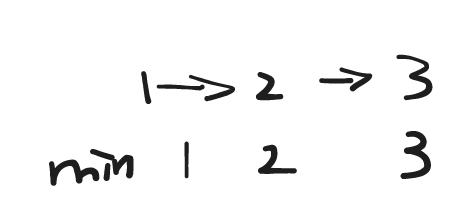

## 题目

[155. 最小栈](https://leetcode.cn/problems/min-stack/)

设计一个支持 `push` ，`pop` ，`top` 操作，并能在常数时间内检索到最小元素的栈。

实现 `MinStack` 类:

- `MinStack()` 初始化堆栈对象。
- `void push(int val)` 将元素val推入堆栈。
- `void pop()` 删除堆栈顶部的元素。
- `int top()` 获取堆栈顶部的元素。
- `int getMin()` 获取堆栈中的最小元素。

 

**示例 1:**

```
输入：
["MinStack","push","push","push","getMin","pop","top","getMin"]
[[],[-2],[0],[-3],[],[],[],[]]

输出：
[null,null,null,null,-3,null,0,-2]

解释：
MinStack minStack = new MinStack();
minStack.push(-2);
minStack.push(0);
minStack.push(-3);
minStack.getMin();   --> 返回 -3.
minStack.pop();
minStack.top();      --> 返回 0.
minStack.getMin();   --> 返回 -2.
```

 

**提示：**

- `-231 <= val <= 231 - 1`
- `pop`、`top` 和 `getMin` 操作总是在 **非空栈** 上调用
- `push`, `pop`, `top`, and `getMin`最多被调用 `3 * 104` 次


## 代码

### 辅助栈做法

```java
class MinStack {
    Deque<Integer> st = new ArrayDeque<>();
    Deque<Integer> min = new ArrayDeque<>();
    public MinStack() {
        
    }
    
    public void push(int val) {
        st.push(val);
		if(min.size()==0 || min.peek()>val){
            min.push(val);
        }else{
            min.push(min.peek());
        }
    }
    
    public void pop() {
		st.pop();
        min.pop();
    }
    
    public int top() {
		return st.peek();
    }
    
    public int getMin() {
		return min.peek();
    }
}
```

### 链表做法

```java
class MinStack {
    
    Node head=null;

    public MinStack() {
        
    }
    
    public void push(int val) {
        if(head==null){
            head = new Node(val,val);
        }else{
            head = new Node(val,Math.min(val,head.min),head);
        }
    }
    
    public void pop() {
        head=head.next;
    }
    
    public int top() {
        return head.val;
    }
    
    public int getMin() {
        return head.min;
    }

    private class Node{
        int val;
        int min;
        Node next;
        Node(int val,int min){
            this.val=val;
            this.min=min;
        }
        Node(int val,int min,Node next){
            this.val=val;
            this.min=min;
            this.next=next;
        }
    }
}
```


## 思路

### 辅助栈

对于本题需要栈中的最小元素 

我们可以额外启用一个辅助栈 min 用了存储当前的栈中的最小的元素

由于栈先进后出的特性, 对于后续需要入栈的元素, 如果val < 当前的最小值

那么我们可以重复添加一次当前的最小值 

然后在pop的时候, 每次的pop都能保存到最小值对应的位置。

### 链表

我们可以回归到本质 , 仍然是利用栈先进后出的特点

当我们获取到 栈的一个状态的时候, 当前的状态对应的min 应该是确定的,

因为即便之后可能会存在更小的min , 但是当我们回到当前的这个状态之后, 之后的min已经被pop出去了

因此可以利用这个特点来使用链表来完成题目的要求: 




