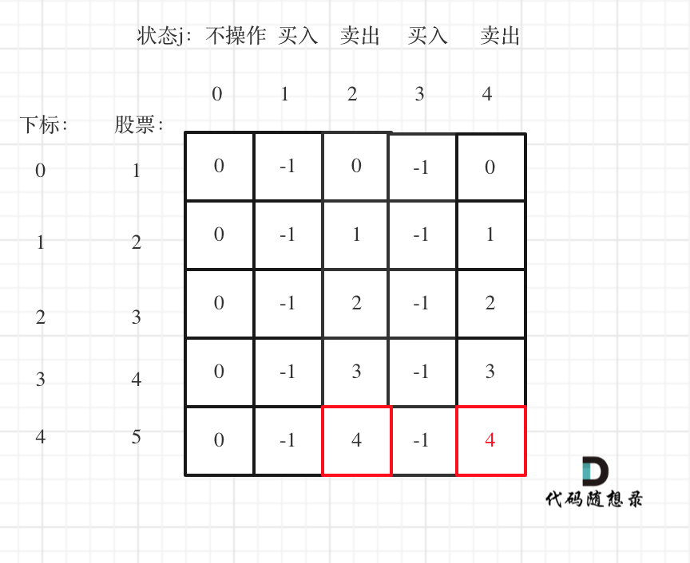

## 题目

[188. 买卖股票的最佳时机 IV](https://leetcode.cn/problems/best-time-to-buy-and-sell-stock-iv/)

给你一个整数数组 `prices` 和一个整数 `k` ，其中 `prices[i]` 是某支给定的股票在第 `i` 天的价格。

设计一个算法来计算你所能获取的最大利润。你最多可以完成 `k` 笔交易。也就是说，你最多可以买 `k` 次，卖 `k` 次。

**注意：**你不能同时参与多笔交易（你必须在再次购买前出售掉之前的股票）。

 

**示例 1：**

```
输入：k = 2, prices = [2,4,1]
输出：2
解释：在第 1 天 (股票价格 = 2) 的时候买入，在第 2 天 (股票价格 = 4) 的时候卖出，这笔交易所能获得利润 = 4-2 = 2 。
```

**示例 2：**

```
输入：k = 2, prices = [3,2,6,5,0,3]
输出：7
解释：在第 2 天 (股票价格 = 2) 的时候买入，在第 3 天 (股票价格 = 6) 的时候卖出, 这笔交易所能获得利润 = 6-2 = 4 。
     随后，在第 5 天 (股票价格 = 0) 的时候买入，在第 6 天 (股票价格 = 3) 的时候卖出, 这笔交易所能获得利润 = 3-0 = 3 。
```

 

**提示：**

- `1 <= k <= 100`
- `1 <= prices.length <= 1000`
- `0 <= prices[i] <= 1000`


## 代码

```java
class Solution {
    public int maxProfit(int k, int[] prices) {
        // dp[i][j] 第i天经历第j次操作的之后剩余的现金
        // j : 0: 未操作 : 1: 第1次买入 2: 第
        // 未操作
        // j: [1,2k]
        // dp[i][j]=
        // 第k次买入
        // 第k次卖出
        int[][] dp = new int[prices.length + 1][2 * k + 1];
        int res = 0;
        dp[0][0] = 0;
        for (int i = 1; i < 2*k; i+=2) {
            // 买入
            dp[0][i] = -prices[0];            
        }
        for (int i = 1; i < prices.length; i++) {
            dp[i][0] = dp[i - 1][0];
            for (int j = 0; j < 2 * k - 1; j+=2) {
                // 买入(取前一次的卖出-prices[i]或者是沿用上一次的买入)
                dp[i][j+1]=Math.max(dp[i-1][j]-prices[i],dp[i-1][j+1]);
                // 卖出(取前一次的买入+prices[i]或者是沿用上一次的卖出)
                dp[i][j+2]=Math.max(dp[i-1][j+1]+prices[i],dp[i-1][j+2]);
            }
        }
        return dp[prices.length-1][2 * k];
    }
}
```


## 思路

本题的思路是建立在前一题的基础之上的 :  https://leetcode.cn/problems/best-time-to-buy-and-sell-stock-iii/

以下是上一题的思路

---

> 状态 : 并不是说在这一天的操作
> `dp[i][j]` 表示**剩余的最大现金**
>
> 0 到第i天还没有任何操作
> 1 到第i天第一次有股票 (可能是之前买过了股票或者是第i天刚好卖股票)
> 2 到第i天第一次卖股票
>
> 3 到第i天第二次有股票
> 4 到第i天第二次卖股

关键在于至多买卖两次，这意味着可以买卖一次，可以买卖两次，也可以不买卖。

接来下我用动态规划五部曲详细分析一下：

1. 确定dp数组以及下标的含义

一天一共就有五个状态，

1. 没有操作 （其实我们也可以不设置这个状态）
2. 第一次持有股票
3. 第一次不持有股票
4. 第二次持有股票
5. 第二次不持有股票

dp[i][j]中 i表示第i天，j为 [0 - 4] 五个状态，dp[i][j]表示第i天状态j所剩最大现金。

需要注意：dp[i][1]，**表示的是第i天，买入股票的状态，并不是说一定要第i天买入股票，这是很多同学容易陷入的误区**。

例如 dp[i][1] ，并不是说 第i天一定买入股票，有可能 第 i-1天 就买入了，那么 dp[i][1] 延续买入股票的这个状态。

1. 确定递推公式

达到dp[i][1]状态，有两个具体操作：

- 操作一：第i天买入股票了，那么`dp[i][1] = dp[i-1][0] - prices[i]`
- 操作二：第i天没有操作，而是沿用前一天买入的状态，即：`dp[i][1] = dp[i - 1][1]`

那么`dp[i][1]`究竟选` dp[i-1][0] - prices[i]`，还是`dp[i - 1][1]`呢？

一定是选最大的，所以 `dp[i][1] = max(dp[i-1][0] - prices[i], dp[i - 1][1]);`

同理dp[i][2]也有两个操作：

- 操作一：第i天卖出股票了，那么`dp[i][2] = dp[i - 1][1] + prices[i]`
- 操作二：第i天没有操作，沿用前一天卖出股票的状态，即：`dp[i][2] = dp[i - 1][2]`

所以`dp[i][2] = max(dp[i - 1][1] + prices[i], dp[i - 1][2])`

同理可推出剩下状态部分：

`dp[i][3] = max(dp[i - 1][3], dp[i - 1][2] - prices[i]);`

`dp[i][4] = max(dp[i - 1][4], dp[i - 1][3] + prices[i]);`

1. dp数组如何初始化

第0天没有操作，这个最容易想到，就是0，即：`dp[0][0] = 0;`

第0天做第一次买入的操作，`dp[0][1] = -prices[0];`

第0天做第一次卖出的操作，这个初始值应该是多少呢？

此时还没有买入，怎么就卖出呢？ 其实大家可以理解当天买入，当天卖出，所以`dp[0][2] = 0;`

第0天第二次买入操作，初始值应该是多少呢？应该不少同学疑惑，第一次还没买入呢，怎么初始化第二次买入呢？

第二次买入依赖于第一次卖出的状态，其实相当于第0天第一次买入了，第一次卖出了，然后再买入一次（第二次买入），那么现在手头上没有现金，只要买入，现金就做相应的减少。

所以第二次买入操作，初始化为：`dp[0][3] = -prices[0];`

同理第二次卖出初始化`dp[0][4] = 0;`

1. 确定遍历顺序

从递归公式其实已经可以看出，一定是从前向后遍历，因为dp[i]，依靠dp[i - 1]的数值。

1. 举例推导dp数组

以输入`[1,2,3,4,5]`为例



大家可以看到红色框为最后两次卖出的状态。

现在最大的时候一定是卖出的状态，而两次卖出的状态现金最大一定是最后一次卖出。如果想不明白的录友也可以这么理解：如果第一次卖出已经是最大值了，那么我们可以在当天立刻买入再立刻卖出。所以`dp[4][4]`已经包含了`dp[4][2]`的情况。也就是说第二次卖出手里所剩的钱一定是最多的。

所以最终最大利润是`dp[4][4]`

---

本题与上一题的主要区别是  , 我们可以操作(买卖) 的次数是 k 次,  上一题其实也就是 K=2的特例,  

因此我们的首要做法是 **抽离出公共的代码** ,  想一想通用的做法是什么

首先定义 dp数组

` dp[i][j]` 第i天经历第j次操作的之后剩余的现金

 j : 0: 未操作 , **1: 第1次买入 ,  2: 第1次卖出 , 3: 第2次买入 ,  4: 第 2次卖出 ...** 

不难得出 ` dp[i][j]` 其中的 j (<u>这里假定j为偶数 , **表示在某一天买卖的买操作**</u>) 表示为:    **j/2第  i天的第 j/2 次 买操作 ,    j/2+1 : 第 i天的第 j/2+1次卖操作**

核心在于 每一天的买卖操作 (无论是第几次)  , 都是依赖于前一天的买卖操作的,  

基础的, 对于第一天 , 我们可以买卖 n 次 , 保证第一天的操作次数是满足设定的

因此可以初始化`dp[0]`为

**每次买入需要扣除现金(在这之前需要出售前一次买的股票 )**

```java
for (int i = 1; i < 2*k; i+=2) {
    dp[0][i] = -prices[0];            
}
```

那么对于之后的一般天数以及通用的操作

对于买操作 : 取前一次的卖出-prices[i]或者是沿用上一次的买入 

-  `dp[i][j+1]=Math.max(dp[i-1][j]-prices[i],dp[i-1][j+1]);`

对于卖操作 : 取前一次的买入+prices[i]或者是沿用上一次的卖出

- `dp[i][j+2]=Math.max(dp[i-1][j+1]+prices[i],dp[i-1][j+2]);`