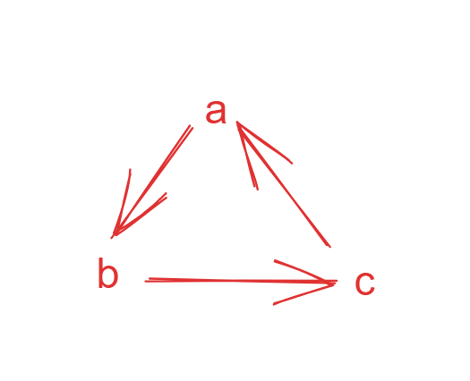

## 题目

[207. 课程表](https://leetcode.cn/problems/course-schedule/)

你这个学期必须选修 `numCourses` 门课程，记为 `0` 到 `numCourses - 1` 。

在选修某些课程之前需要一些先修课程。 先修课程按数组 `prerequisites` 给出，其中 `prerequisites[i] = [ai, bi]` ，表示如果要学习课程 `ai` 则 **必须** 先学习课程 `bi` 。

- 例如，先修课程对 `[0, 1]` 表示：想要学习课程 `0` ，你需要先完成课程 `1` 。

请你判断是否可能完成所有课程的学习？如果可以，返回 `true` ；否则，返回 `false` 。

**示例 1：**

```
输入：numCourses = 2, prerequisites = [[1,0]]
输出：true
解释：总共有 2 门课程。学习课程 1 之前，你需要完成课程 0 。这是可能的。
```

**示例 2：**

```
输入：numCourses = 2, prerequisites = [[1,0],[0,1]]
输出：false
解释：总共有 2 门课程。学习课程 1 之前，你需要先完成课程 0 ；并且学习课程 0 之前，你还应先完成课程 1 。这是不可能的。
```

 

**提示：**

- `1 <= numCourses <= 2000`
- `0 <= prerequisites.length <= 5000`
- `prerequisites[i].length == 2`
- `0 <= ai, bi < numCourses`
- `prerequisites[i]` 中的所有课程对 **互不相同**

## 代码

### BFS

```java
class Solution {
    public boolean canFinish(int numCourses, int[][] prerequisites) {
        // traverse of graph
        // 是否成环 ? true : false
        List<List<Integer> > graph = new ArrayList();
        var que = new LinkedList<Integer>();
        // 入度
        int[]indegress = new int[numCourses];
        for(int i=0;i<numCourses;i++){
            graph.add(new ArrayList());
        }
        for(int[] a:prerequisites){
            indegress[a[0]]++;
            graph.get(a[1]).add(a[0]);
        }
        for(int i=0;i<numCourses;i++){
            if(indegress[i]==0){
                que.add(i);
            }
        }
        // 从入度为0 的点开始遍历 BFS
        while(que.size()!=0){
            int pre = que.poll();
            numCourses--;
            for(int cur:graph.get(pre)){
                if(--indegress[cur]==0) que.add(cur);
            }
        }
        return numCourses==0;
    }
}
```

### DFS

```java
class Solution {
    // 1 表示访问过, -1表示遍历过不会成环(剪枝)
    int[]visited;
    public boolean canFinish(int numCourses, int[][] prerequisites) {
        List<List<Integer>> graph = new ArrayList<>();
        for(int i = 0; i < numCourses; i++)
            graph.add(new ArrayList<>());
        visited=new int[numCourses];
        for(int[]a :prerequisites){
            graph.get(a[1]).add(a[0]);
        }
        for(int i=0;i<numCourses;i++){
            if(dfs(graph,i)) return false;
        }
        return true;
    }

    // 如果成环返回true
    private boolean dfs(List<List<Integer> > graph ,int course){
        if(visited[course]==1) return true;
        if(visited[course]==-1) return false;
        visited[course]=1;
        for(int c:graph.get(course)){
            if(dfs(graph,c)) return true;
        }
        visited[course]=-1;
        return false;
    }
}
```

## 思路

<u>其中 `prerequisites[i] = [ai, bi]` ，表示如果要学习课程 `ai` 则 **必须** 先学习课程 `bi` 。</u>

如果对比成一个有向图, 那么图的指向应该是 `bi->ai`

其实通过prerequisites数组我们可以构造出一个图 , 判定的条件就是图中有没有环

如果图中有环 ,  比如 a->b , b->c , c->a ,那么就会出现死锁, 导致无法学完课程

> **下图中箭头的指向表示先修的关系**



那么对于一般的可以完成的情况 ,课程之间的依赖关系应该是一个有向无环图 , 比如


**上图中对应的prerequisites**的情况应该是  `[[1,0],[2,0],[2,1],[3,2]]` , (假设 a b c d 分别代表  1 2 3 4 ) 

### BFS

对于BFS , 我们首先需要找到图中入度为0 的点 , 即为pre (作为我们遍历的起点)  ,  然后在每一轮遍历的时候将  pre.nodes 的入度-1 , 标记当前的路线已经走过了

比如对于 a -> c

indegrees[c]=2 (看图)

在我们走过a -> c 这条线之后 , indegrees[c]=1 , 当一个点的入度已经变为0之后, 这时可以考虑开始从这个点继续遍历(添加到队列中)

> 每次遍历完一个点之后 , numCourses --  , 表示当前的一个课程已经学完了  , 并且 以这个点作为前置课程的其他课程 , 如果满足条件(满足已经学完了前置课程, 对应的就是入度数组为0 ) , 那么就可以开始学习这门课了。

### DFS

DFS的做法与BFS的核心思路是类似的 ， 不过我们通过一个visited数组以及path来进行标记 

visited[] 标记当前正在学习的课程 , 如果在学习的时候发现某个课程还需要学习(这个课程已经在path中并且又遍历到了)  , 此时说明出现了环 , **表示无法完成学习** 

> 其实就是一个 构建graph , 然后判断是否成环的过程


