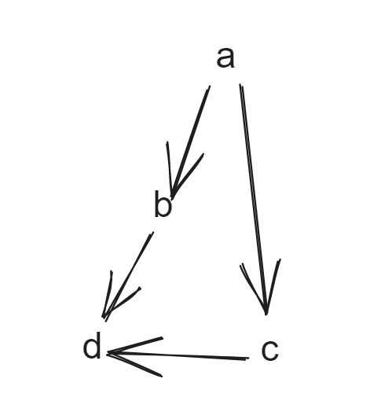

## 题目

[210. 课程表 II](https://leetcode.cn/problems/course-schedule-ii/)

现在你总共有 `numCourses` 门课需要选，记为 `0` 到 `numCourses - 1`。给你一个数组 `prerequisites` ，其中 `prerequisites[i] = [ai, bi]` ，表示在选修课程 `ai` 前 **必须** 先选修 `bi` 。

- 例如，想要学习课程 `0` ，你需要先完成课程 `1` ，我们用一个匹配来表示：`[0,1]` 。

返回你为了学完所有课程所安排的学习顺序。可能会有多个正确的顺序，你只要返回 **任意一种** 就可以了。如果不可能完成所有课程，返回 **一个空数组** 。

 

**示例 1：**

```
输入：numCourses = 2, prerequisites = [[1,0]]
输出：[0,1]
解释：总共有 2 门课程。要学习课程 1，你需要先完成课程 0。因此，正确的课程顺序为 [0,1] 。
```

**示例 2：**

```
输入：numCourses = 4, prerequisites = [[1,0],[2,0],[3,1],[3,2]]
输出：[0,2,1,3]
解释：总共有 4 门课程。要学习课程 3，你应该先完成课程 1 和课程 2。并且课程 1 和课程 2 都应该排在课程 0 之后。
因此，一个正确的课程顺序是 [0,1,2,3] 。另一个正确的排序是 [0,2,1,3] 。
```

**示例 3：**

```
输入：numCourses = 1, prerequisites = []
输出：[0]
```

 

**提示：**

- `1 <= numCourses <= 2000`
- `0 <= prerequisites.length <= numCourses * (numCourses - 1)`
- `prerequisites[i].length == 2`
- `0 <= ai, bi < numCourses`
- `ai != bi`
- 所有`[ai, bi]` **互不相同**


## 代码

### DFS

```java
class Solution {
    int[]visited ;
    List<Integer> path ;
    public int[] findOrder(int numCourses, int[][] prerequisites) {
        List<List<Integer> > graph = new ArrayList();
        visited=new int[numCourses];
        path = new ArrayList();
        for(int i=0;i<numCourses;i++) graph.add(new ArrayList());
        for(int[] a:prerequisites){
            graph.get(a[1]).add(a[0]);
        }
        for(int i=0;i<numCourses;i++){
            if(visited[i]==0){
                if(!dfs(graph,i)) return new int[0];
            }
        }
        int[]res=new int[path.size()];
        for(int j=0;j<res.length;j++){
            res[j]=path.get(path.size()-1-j);
        }
        return res;
    }

    // 如正常return true
    private boolean dfs(List<List<Integer> > graph,int course){
        if(visited[course]==1) return false;// 有环
        if(visited[course]==2) return true;
        visited[course]=1;
        // System.out.println(course);
        for(int a:graph.get(course)){
            if(visited[a]==0){
                if(!dfs(graph,a)) return false; 
            }else if(visited[a]==1){
                return false;
            }
        }
        visited[course]=2;// 已经遍历过并且没有环
        path.add(course);
        return true;
    }
}
```

## 思路

本题 与 ***208课程表*** 几乎一模一样 , 在208的基础之上只需要添加对应的遍历路径即可 , 需要注意的是我们在添加访问节点的时候

需要把遍历的逻辑写到添加节点的逻辑前面 , 并且在最后返回结果的时候需要倒序的返回(先选->后选)的关系

例如下面的结构

如果我们先添加当前的节点再去遍历

那么最后的序列就是 `0 1 3 2` 可这实际上与我们构造的graph是没有什么必然的联系的

正确的做法是先遍历(遍历的时候相当于 先添加了后选的节点 , 这样可以保证节点的顺序是满足graph的)再去添加

这样的做法的结果是 `3 1 2 0`

