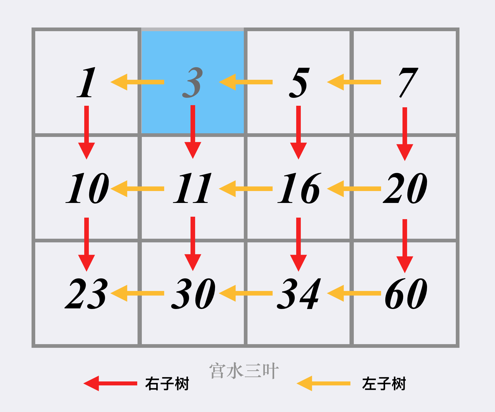

## 题目

[240. 搜索二维矩阵 II](https://leetcode.cn/problems/search-a-2d-matrix-ii/)

编写一个高效的算法来搜索 `*m* x *n*` 矩阵 `matrix` 中的一个目标值 `target` 。该矩阵具有以下特性：

- 每行的元素从左到右升序排列。
- 每列的元素从上到下升序排列。

**示例 1：**


```
输入：matrix = [[1,4,7,11,15],[2,5,8,12,19],[3,6,9,16,22],[10,13,14,17,24],[18,21,23,26,30]], target = 5
输出：true
```

**示例 2：**


```
输入：matrix = [[1,4,7,11,15],[2,5,8,12,19],[3,6,9,16,22],[10,13,14,17,24],[18,21,23,26,30]], target = 20
输出：false
```

 

**提示：**

- `m == matrix.length`
- `n == matrix[i].length`
- `1 <= n, m <= 300`
- `-109 <= matrix[i][j] <= 109`
- 每行的所有元素从左到右升序排列
- 每列的所有元素从上到下升序排列
- `-109 <= target <= 109`


## 代码

每一行的数组都是有序的, **简单的做法就是对于每一行去二分**

```java
class Solution {
    public boolean searchMatrix(int[][] matrix, int target) {
        // 二分
        int n=matrix[0].length;
        for(int i=matrix.length-1;i>=0;i--){
            int[]nums=matrix[i];
            if(nums[0] > target || nums[n-1]<target){
                continue;
            }
            int l=0,r=n;
            int m = -1;
            while(l<r){
                m=l+(r-l)/2;
                if(nums[m]<target){
                    l=m+1;
                }else if(nums[m]>target){
                    r=m;
                }else{
                    return true;
                }
            }
        }
        return false;
    }
}
```

### 抽象BST

```java
class Solution {
    public boolean searchMatrix(int[][] matrix, int target) {
        int m=matrix.length,n=matrix[0].length;
        int l=0,r=n-1;
        while(l<m && r>=0){
            if(matrix[l][r]<target){
                l++;
            }else if(matrix[l][r]>target){
                r--;
            }else{
                return true;
            }
        }
        return false;
    }
}
```

## 思路

这里主要来学习一个抽象BST的解法



图片已经很清晰了, 具体就是把右上角的元素当做根节点, 

通过元素的大小关系来判断 走向即可

