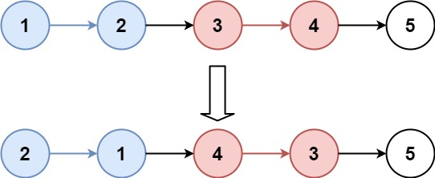

## 题目

[25. K 个一组翻转链表](https://leetcode.cn/problems/reverse-nodes-in-k-group/)

给你链表的头节点 `head` ，每 `k` 个节点一组进行翻转，请你返回修改后的链表。

`k` 是一个正整数，它的值小于或等于链表的长度。如果节点总数不是 `k` 的整数倍，那么请将最后剩余的节点保持原有顺序。

你不能只是单纯的改变节点内部的值，而是需要实际进行节点交换。

 

**示例 1：**



```
输入：head = [1,2,3,4,5], k = 2
输出：[2,1,4,3,5]
```

**示例 2：**


```
输入：head = [1,2,3,4,5], k = 3
输出：[3,2,1,4,5]
```

 

**提示：**

- 链表中的节点数目为 `n`
- `1 <= k <= n <= 5000`
- `0 <= Node.val <= 1000`

 

**进阶：**你可以设计一个只用 `O(1)` 额外内存空间的算法解决此问题吗？


## 代码

```java
class Solution {
    public ListNode reverseKGroup(ListNode head, int k) {
        ListNode cur = head;
        int len = getLen(head);
        head = reverseN(head,k);
        len-=k;
        while(len>=k){
            // 每轮的cur为上一次反转的N个节点的最后一个节点
            // 指向下一轮反转的起始节点
            ListNode tmp = cur.next;
            ListNode newHead = reverseN(cur.next,k);
            cur.next = newHead;
            cur=tmp;
            len-=k;
        }
        return head;
    }
    
    ListNode other = null;
    // 反转从head开始计数的N个节点, 返回新的head
    private ListNode reverseN(ListNode head,int n){
        if(n==1){
            other = head.next;
            return head;
        }
        ListNode newHead = reverseN(head.next,n-1);
        head.next.next = head;
        head.next = other;
        return newHead;
    }
    private int getLen(ListNode head){
        int idx = 0;
        while(head!=null){
            idx++;
            head=head.next; 
        }
        return idx;
    }
}
```

## 思路

每隔K个节点对链表进行反转即可, 关键在于反转N个节点的递归方法如何编写

**这里的代码记住即可**

```java
    ListNode other = null;
    // 反转从head开始计数的N个节点, 返回新的head
    private ListNode reverseN(ListNode head,int n){
        if(n==1){
            other = head.next;
            return head;
        }
        ListNode newHead = reverseN(head.next,n-1);
        head.next.next = head;
        head.next = other;
        return newHead;
    }
```

对于链表相关的题目 , 只要掌握了常规的操作

倒数K个

反转部分( 反转 区间 , 反转个数等等 , 反转倒数)

基本上都是各种技巧之间的转换 , **熟练之后还是比较轻松的**

