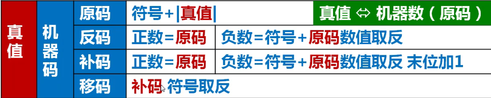

## 题目

[260. 只出现一次的数字 III](https://leetcode.cn/problems/single-number-iii/)

给你一个整数数组 `nums`，其中恰好有两个元素只出现一次，其余所有元素均出现两次。 找出只出现一次的那两个元素。你可以按 **任意顺序** 返回答案。

你必须设计并实现线性时间复杂度的算法且仅使用常量额外空间来解决此问题。

 

**示例 1：**

```
输入：nums = [1,2,1,3,2,5]
输出：[3,5]
解释：[5, 3] 也是有效的答案。
```

**示例 2：**

```
输入：nums = [-1,0]
输出：[-1,0]
```

**示例 3：**

```
输入：nums = [0,1]
输出：[1,0]
```

 

**提示：**

- `2 <= nums.length <= 3 * 104`
- `-231 <= nums[i] <= 231 - 1`
- 除两个只出现一次的整数外，`nums` 中的其他数字都出现两次


## 代码

```java
class Solution {
    public int[] singleNumber(int[] nums) {
       int x=0;
        for(int i:nums){
            x^=i;
        }
        int l1= (x==Integer.MIN_VALUE? x : x&-x);
        int t1=0,t2=0;
        //System.out.println("l1:"+l1);
        for(int i:nums){
        //System.out.println("i:"+i+" ,l1&i: "+(l1&i));
            if((i&l1)!=0){
                t1^=i;
            }else{
                t2^=i;
            }
        }
        return new int[]{t1,t2};
    }
}
/**
l1:2
i:1 ,l1&i: 0
i:2 ,l1&i: 2
i:1 ,l1&i: 0
i:3 ,l1&i: 2
i:2 ,l1&i: 2
i:5 ,l1&i: 0
*/
```

## 思路

首先需要明确的一点是计算机在底层计算的时候都是使用补码进行计算 




另外, 对于数字x ,  x的补码和-x的补码有一定规律(x非零)，

例如 5 与 -5

```
11111011
00000101
```

本题我们利用异或以及补码的特性

首先对nums的所有元素进行异或 , 得出两个 数字异或的值 , 记为x

对于x , 我们知道x的二进制形式中每一位为1 表明原来的两个数字在这一位是不同的.

接着利用补码的特性 , 通过x&-x求出x从右到左第一个为1的位 , 记为l1

接着我们通过 l1位所在的数字是否为 1 , 将原来的数组分成两组 ,  其中一组(l1所在的位)为1,  另一组为0  

对于两个相同的数字必然存在 a^a==0 , 因此我们通过分类数组,  可以吧原来不同的两个元素分成两组 , 并且在异或完毕之后

最终得到的结果就是那两个不同的数字