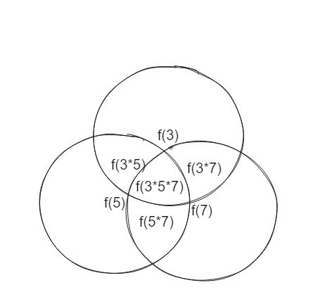

## 题目

[2652. 倍数求和](https://leetcode.cn/problems/sum-multiples/)

给你一个正整数 `n` ，请你计算在 `[1，n]` 范围内能被 `3`、`5`、`7` 整除的所有整数之和。

返回一个整数，用于表示给定范围内所有满足约束条件的数字之和。

 

**示例 1：**

```
输入：n = 7
输出：21
解释：在 [1, 7] 范围内能被 3、5、7 整除的所有整数分别是 3、5、6、7 。数字之和为 21 。
```

**示例 2：**

```
输入：n = 10
输出：40
解释：在 [1, 10] 范围内能被 3、5、7 整除的所有整数分别是 3、5、6、7、9、10 。数字之和为 40 。
```

**示例 3：**

```
输入：n = 9
输出：30
解释：在 [1, 9] 范围内能被 3、5、7 整除的所有整数分别是 3、5、6、7、9 。数字之和为 30 。
```

 

**提示：**

- `1 <= n <= 103`

## 代码

最简单的做法是遍历然后维护res即可

```java
class Solution {
    public int sumOfMultiples(int n) {
        int res=0;
        for(int i=1;i<=n;i++){
            if(i%3==0 || i%5==0 || i%7==0){
                res+=i;
            }
        }
        return res;
    }
}
```

或者我们通过等差数列的性质来快速计算

```java
class Solution {
    int n;
    public int sumOfMultiples(int n) {
        this.n=n;
        return f(3)+f(5)+f(7)+f(3*5*7)-f(3*7)-f(5*7)-f(3*5) ;
    }
    public int f(int x){
        int m = n/x;
        return m*(x+m*x)/2;
    }
}
```

## 思路

关于容斥定理 : https://oi-wiki.org/math/combinatorics/inclusion-exclusion-principle/

对于 n , 假设我们需要计算[1,n]中可以整除3的数字的和 , 那么相当于计算

项数为 n/3 , 首项为3, 末项为 n/3 * 3的等差数列的前 n/3项的和

记为f(x) `m`表示项数

```java
public int f(int x){
    int m = n/x;
    return m*(x+m*x)/2;
}
```

我们通过计算 `f(3)+f(5)+f(7)+f(3*5*7)` , 需要注意的是需要减去其中多余的部分



比如 n = 35

那么

```
f(3) = 3 6 9 12 15 18 21 24 27 30 33
f(5) = 5 10 15 20 25 30 
f(7) = 7 14 21 28 35
f(3*5) = 15 30
f(3*7) = 21
f(5*7) = 35
f(3*5*7) = {}
```

其中 15 30 21 35 我们重复计算了两次