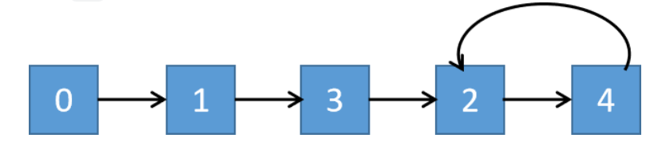
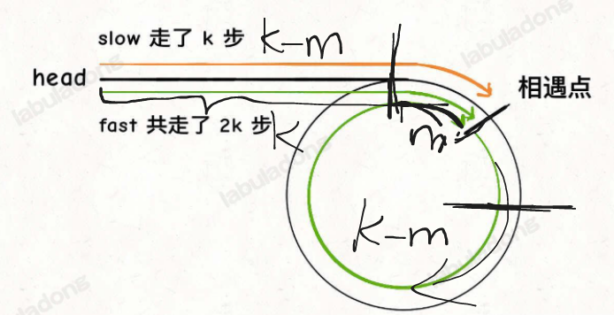

## 题目

[287. 寻找重复数](https://leetcode.cn/problems/find-the-duplicate-number/)

给定一个包含 `n + 1` 个整数的数组 `nums` ，其数字都在 `[1, n]` 范围内（包括 `1` 和 `n`），可知至少存在一个重复的整数。

假设 `nums` 只有 **一个重复的整数** ，返回 **这个重复的数** 。

你设计的解决方案必须 **不修改** 数组 `nums` 且只用常量级 `O(1)` 的额外空间。

 

**示例 1：**

```
输入：nums = [1,3,4,2,2]
输出：2
```

**示例 2：**

```
输入：nums = [3,1,3,4,2]
输出：3
```

 

**提示：**

- `1 <= n <= 105`
- `nums.length == n + 1`
- `1 <= nums[i] <= n`
- `nums` 中 **只有一个整数** 出现 **两次或多次** ，其余整数均只出现 **一次**

 

**进阶：**

- 如何证明 `nums` 中至少存在一个重复的数字?
- 你可以设计一个线性级时间复杂度 `O(n)` 的解决方案吗？

## 代码

```java
class Solution {
    public int findDuplicate(int[] nums) {
        int s=nums[0],f=nums[nums[0]];
        while(s!=f){
            s=nums[s];
            f=nums[nums[f]];
        }
        s=0;
        while(s!=f){
            s=nums[s];
            f=nums[f];
        }
        return s;
    }
}
```

go

```go
func findDuplicate(nums []int) int {
    s,f:=nums[0],nums[nums[0]]
    for s!=f{
        s=nums[s];
        f=nums[nums[0]]
    }
    s=0
    for s!=f{
        s=nums[s]
        f=nums[f]
    }
    return s
}
```

本题 通过快慢指针的思想

## 思路

我们从下标为 0 出发，根据 f(n) 计算出一个值，以这个值为新的下标，再用这个函数计算，以此类推产生一个类似链表一样的序列。
0->1->3->2->4->2->4->2->……



关于环形链表 , 可以参考下图: 



注意环形的遍历方向是顺时针 , 这里对应这代码中的

```
slow=0;
while s!= f{
	s..
	f..
}
```


