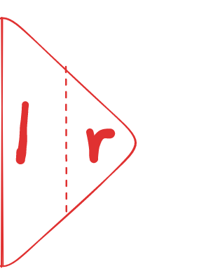

## 题目

[295. 数据流的中位数](https://leetcode.cn/problems/find-median-from-data-stream/)

**中位数**是有序整数列表中的中间值。如果列表的大小是偶数，则没有中间值，中位数是两个中间值的平均值。

- 例如 `arr = [2,3,4]` 的中位数是 `3` 。
- 例如 `arr = [2,3]` 的中位数是 `(2 + 3) / 2 = 2.5` 。

实现 MedianFinder 类:

- `MedianFinder() `初始化 `MedianFinder` 对象。
- `void addNum(int num)` 将数据流中的整数 `num` 添加到数据结构中。
- `double findMedian()` 返回到目前为止所有元素的中位数。与实际答案相差 `10-5` 以内的答案将被接受。

**示例 1：**

```
输入
["MedianFinder", "addNum", "addNum", "findMedian", "addNum", "findMedian"]
[[], [1], [2], [], [3], []]
输出
[null, null, null, 1.5, null, 2.0]

解释
MedianFinder medianFinder = new MedianFinder();
medianFinder.addNum(1);    // arr = [1]
medianFinder.addNum(2);    // arr = [1, 2]
medianFinder.findMedian(); // 返回 1.5 ((1 + 2) / 2)
medianFinder.addNum(3);    // arr[1, 2, 3]
medianFinder.findMedian(); // return 2.0
```

**提示:**

- `-105 <= num <= 105`
- 在调用 `findMedian` 之前，数据结构中至少有一个元素
- 最多 `5 * 104` 次调用 `addNum` 和 `findMedian`


## 代码

```java
class MedianFinder {
    // 从大到小
    PriorityQueue<Integer> l = new PriorityQueue<>((a,b)->b-a);
    // 从小到大
    PriorityQueue<Integer> r = new PriorityQueue<>((a,b)->a-b);

    public void addNum(int val){
        if(r.size() < l.size()){
            // 添加元素到 r 中
            if(l.peek() < val){
                r.offer(val);
            }else{
                r.offer(l.poll());
                l.offer(val);
            }
        }else{
            // 添加元素到left中
            if(r.size()==0 || val < r.peek()){
                l.offer(val);
            }else{
                l.offer(r.poll());
                r.offer(val);
            }
        }
    }
    public double findMedian() {
        return l.size()==r.size() ? (l.peek()+r.peek())/2.0 : l.peek();
    }
}
```

## 思路

具体的，我们可以使用两个优先队列（堆）来维护整个数据流数据，

令维护数据流左半边数据的优先队列（堆）为1，维护数据流右半边数据的优先队列(堆)为r。

由于优先队列只支持**普通的队列操作**, 因此这里的操作对象是**队头**

- pop
- peek

因此我们这里设置l , r 分别为 从大到小, 从小到大

并且l 中的元素更多

类似于: 

- 3 2 1
- 4 5

完整的添加元素应该是 添加 1 2 3 4 5



再添加的时候, **l的数量为稍大一些**

- 当总的元素个数为偶数, l = r
- 为奇数 : l = r+1

那么通过l , r 存储的特点, 我们可以得知在添加元素的时候 

如果需要添加到 l

- 如果 val < r.peek() 说明此时元素正常添加到 l 
- 否则需要 使用 val 替换掉 r 队头的元素到 l 中

添加到 r

- 如果 l.peek() < val 说明此时元素正常添加到 r 中
- 否则需要 使用 val 替换掉 l 队头的元素到 r 中


