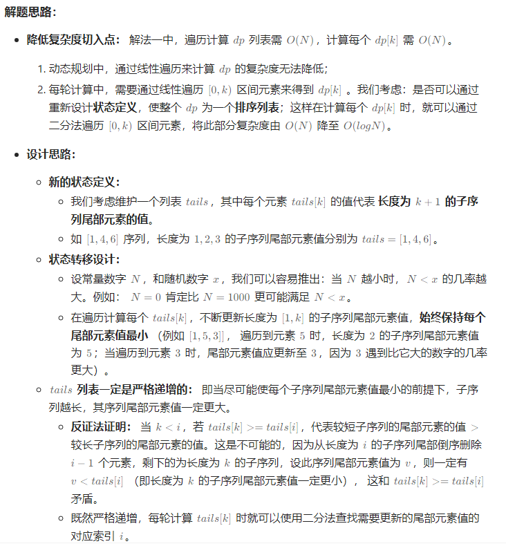

## 题目

[300. 最长递增子序列](https://leetcode.cn/problems/longest-increasing-subsequence/)

给你一个整数数组 `nums` ，找到其中最长严格递增子序列的长度。

**子序列** 是由数组派生而来的序列，删除（或不删除）数组中的元素而不改变其余元素的顺序。例如，`[3,6,2,7]` 是数组 `[0,3,1,6,2,2,7]` 的子序列。

**示例 1：**

```
输入：nums = [10,9,2,5,3,7,101,18]
输出：4
解释：最长递增子序列是 [2,3,7,101]，因此长度为 4 。
```

**示例 2：**

```
输入：nums = [0,1,0,3,2,3]
输出：4
```

**示例 3：**

```
输入：nums = [7,7,7,7,7,7,7]
输出：1
```

 

**提示：**

- `1 <= nums.length <= 2500`
- `-104 <= nums[i] <= 104`

## 代码

```java
class Solution {
    public int lengthOfLIS(int[] nums) {
        int[]dp=new int[nums.length+1];
        Arrays.fill(dp,1);
        int res=1;
        for(int i=1;i<nums.length;i++){
            for(int j=0;j<i;j++){
                if(nums[i]>nums[j])
                    dp[i]=Math.max(dp[i],dp[j]+1);
            }
            res=Math.max(res,dp[i]);
        }
        return  res;
    }
}
```

go代码

```go
func lengthOfLIS(nums []int) int {
    n:=len(nums)
    dp:=make([]int,n)
    // dp[i]表示以nums[i]结尾的最长递增子序列的长度
    res:=1
    for i:=0;i<n;i++{
        dp[i]=1
        for j:=0;j<i;j++{
            if nums[i]>nums[j]{
                dp[i]= max(dp[i],dp[j]+1)
            }
        }
        res=max(dp[i],res)
    }
    return res
}

func max(a, b int) int{
    if a>b{
        return a
    }
    return b;
}
```

### DP+二分查找


```go
func lengthOfLIS(nums []int) int {
    n := len(nums)
    tail := make([]int, n)
    res := 0
    for _,num:=range nums{
        l, r := 0, res
        for l < r {
            m := (l+r)/2
            if tail[m] < num {
                l = m + 1
            } else {
                r = m
            }
        }
        tail[l] = num
        if res == r {
            res++
        }
    }
    return res
}
```


## 思路

### DP

DP做法, 我们定义 dp[i]表示 `0~i`序列中最长递增子序列的长度 

那么 对于 `0<=j<i` 

如果存在 `nums[i]>nums[j]` , 则有 `dp[i]=Math.max(dp[i],dp[j]+1)`;

在统计 dp[i]的过程中, 我们维护res表示最长的递增子序列的长度 , 最后返回即可

> **对于此类统计 一个 集合中 的 最* 的 ** , 通常需要 一个变量来维护** 
>
> **而对于 统计 集合中 最终的 ** , 通常是返回dp数组中最后的结果**


###  DP+二分查找

题解链接 : https://leetcode.cn/problems/longest-increasing-subsequence/solutions/24173/zui-chang-shang-sheng-zi-xu-lie-dong-tai-gui-hua-2/?envType=study-plan-v2&envId=top-100-liked



升级之后算法的好处 

- 更优的时间复杂度 :  **从上面暴力DP的 O(N^2^) 优化到了 O(N * log~N~)**
- 更好的解法 : 这样的解法还可以得出 最长的递增子序列的内容 **(tails数组)**

其实理解这个解法可以这样想: 

题目需要计算 最长递增子序列的元素

因此在这个过程中我们维护递增子序列, **并且每次用较小的值替换调序列中的相对较大的元素**

比如当前的序列为 1 , 6 , 10

然后遍历到了 新的元素为 2 , 后面的序列为 4 10 8

那么这里可以替换 6 -> 2

序列变成 1 2 10

之后逐步替换 10 -> 4

变成 1 2 4 然后追加递增的元素

关键的思想就是 尽量让当前的位置的元素更小, 使得后面的元素能够追加到当前的递增子序列中

在这个过程中 , 由于我们的序列是有序的, 因此可以通过二分来快速定位到 具体的元素

- 如果二分之后下标位于序列中间位置, 那么执行替换 (例如 1 4 6 的序列, 当前的元素为5)
- 如果二分之后下标超出了序列的范围, 那么当前的元素**可以被追加到序列中** (例如 1 4 6 的序列, 元素为 10)

**替换成代码的逻辑就是**

```go
res:=0 // res表示tail中元素的长度
tail:=make([]int,n)
for _,val:=range nums{
	l,r:=0,res
    // 二分确定新增元素在tail中的位置
    for l<r{
        m:=(r+l)/2
        if val>tail[m]{
            l=m+1
        }else {
            r=m
        }
    }
    // 替换 or 添加元素
    tail[l] = val
    // 如果二分之后指针的位置超出了tail的范围(也就是指针的位置刚好等于tail的长度+1, 说明此时执行的操作是新增操作, 长度++)
    if res == l{
        res++
    }
}
return res
```


