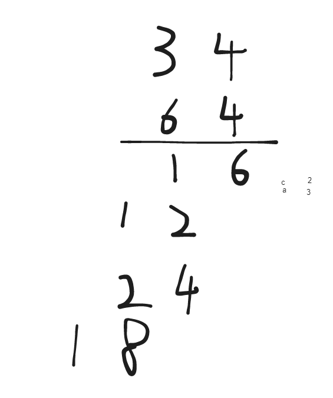

## 题目

- [43. 字符串相乘](https://leetcode.cn/problems/multiply-strings/)

给定两个以字符串形式表示的非负整数 `num1` 和 `num2`，返回 `num1` 和 `num2` 的乘积，它们的乘积也表示为字符串形式。

**注意：**不能使用任何内置的 BigInteger 库或直接将输入转换为整数。

 

**示例 1:**

```
输入: num1 = "2", num2 = "3"
输出: "6"
```

**示例 2:**

```
输入: num1 = "123", num2 = "456"
输出: "56088"
```

 

**提示：**

- `1 <= num1.length, num2.length <= 200`
- `num1` 和 `num2` 只能由数字组成。
- `num1` 和 `num2` 都不包含任何前导零，除了数字0本身。

## 代码

```java
class Solution {
    public String multiply(String a, String b) {
        int m=a.length(),n=b.length();
        char[]csa=a.toCharArray();
        char[]csb=b.toCharArray();
        int[]vals= new int[m+n];
        for(int i=m-1;i>=0;i--){
            for(int j=n-1;j>=0;j--){
                int tmp =(csa[i]-0x30)*(csb[j]-0x30);
                // p1 是进位,p2为当前结果所处的位置
                int p1=i+j,p2=i+j+1;
                int val = vals[p2]+tmp;
                vals[p2]=val%10;
                vals[p1]+=val/10;
            }
        }
        int idx=0;
        // 这里注意不要把 idx++ 写到 []里面
        while(idx<vals.length && vals[idx]==0) idx++;
        var sb =  new StringBuilder();
        while(idx<vals.length){
            sb.append(vals[idx++]);
        }
        return sb.toString().equals("")?"0":sb.toString();
    }
}
```

## 思路

首先我们需要知道一个结论(姑且算是结论)

对于 n 位 的数字 乘以 m 位的数字(正数)

他们的乘积的结果的位数不会超过 m+n

首先确定有正数a , b , 他们的位数分别是 m ,n 位

则他们的乘积不会超过 pow(10,m) * pow(10,n) = pow(10,m+n) , 也就是说他们的位数不会超过 m+n

因此可以有下面的思路 



我们定义一个长度为 m+n 的数组` (int[]vals = new int[m+n])`

我们可以对相乘的过程进行拆分 , 讲对应的乘积累加到每一位中, 当所有位都计算完毕之后 , 数组中的元素 (0~n) 就是乘积结果中每一位的值

此时进行处理即可

- 需要跳过前面的0 (比如 2*3 ) , 数组有两位 , 元素分别是 0 , 6
- 需要考虑两个数字相乘为0 的情况(此时res中的元素都是0, 但是题目要求返回的是字符串)

## 另外在写题的时候遇到了一个问题

```
while(idx<vals.length && vals[idx]==0) idx++;
while(idx<vals.length && vals[idx++]==0);
有什么区别

```

这两个循环看起来很相似，但实际上有一些不同之处。

第一个循环:
```java
while(idx<vals.length && vals[idx]==0) 
    idx++;
```
这个循环先检查条件，然后执行循环体，当条件不满足的时候，循环会停止。也就是说，当vals[idx]不等于0时，循环停止，idx不再增加。

第二个循环:
```java
while(idx<vals.length && vals[idx++]==0);
```
这个循环是"do-while"循环的一种简写形式。它在每次循环迭代结束之后，会增加idx的值。因此，即使在条件不满足的情况下，idx仍然会被增加。

因此，尽管这两个循环在检查条件和执行迭代时都会得到相同的结果（只是检查条件时的idx的值会有所不同），但在循环结束之后，idx的最终值可能会不同。

