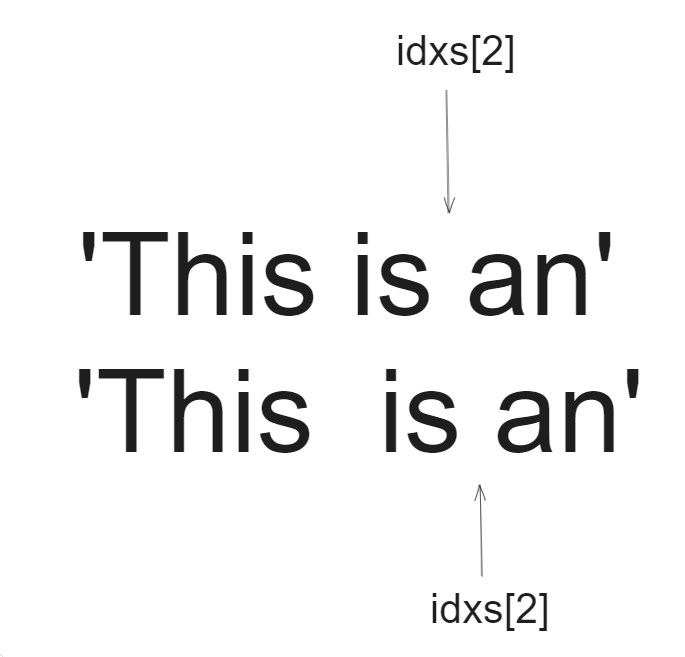

## 题目

[68. 文本左右对齐](https://leetcode.cn/problems/text-justification/)

给定一个单词数组 `words` 和一个长度 `maxWidth` ，重新排版单词，使其成为每行恰好有 `maxWidth` 个字符，且左右两端对齐的文本。

你应该使用 “**贪心算法**” 来放置给定的单词；也就是说，尽可能多地往每行中放置单词。必要时可用空格 `' '` 填充，使得每行恰好有 *maxWidth* 个字符。

要求尽可能均匀分配单词间的空格数量。如果某一行单词间的空格不能均匀分配，则左侧放置的空格数要多于右侧的空格数。

文本的最后一行应为左对齐，且单词之间不插入**额外的**空格。

**注意:**

- 单词是指由非空格字符组成的字符序列。
- 每个单词的长度大于 0，小于等于 *maxWidth*。
- 输入单词数组 `words` 至少包含一个单词。

**示例 1:**

```
输入: words = ["This", "is", "an", "example", "of", "text", "justification."], maxWidth = 16
输出:
[
   "This    is    an",
   "example  of text",
   "justification.  "
]
```

**示例 2:**

```
输入:words = ["What","must","be","acknowledgment","shall","be"], maxWidth = 16
输出:
[
  "What   must   be",
  "acknowledgment  ",
  "shall be        "
]
解释: 注意最后一行的格式应为 "shall be    " 而不是 "shall     be",
     因为最后一行应为左对齐，而不是左右两端对齐。       
     第二行同样为左对齐，这是因为这行只包含一个单词。
```

**示例 3:**

```
输入:words = ["Science","is","what","we","understand","well","enough","to","explain","to","a","computer.","Art","is","everything","else","we","do"]，maxWidth = 20
输出:
[
  "Science  is  what we",
  "understand      well",
  "enough to explain to",
  "a  computer.  Art is",
  "everything  else  we",
  "do                  "
]
```

**提示:**

- `1 <= words.length <= 300`
- `1 <= words[i].length <= 20`
- `words[i]` 由小写英文字母和符号组成
- `1 <= maxWidth <= 100`
- `words[i].length <= maxWidth`

## 代码

```go
class Solution {
    public List<String> fullJustify(String[] words, int maxWidth) {
        var res = new ArrayList<String>();
        int idx=0;
        while(idx < words.length){
            StringBuilder sb = new StringBuilder();
            // 每次贪心最大的单词的个数
            while(idx<words.length && sb.length()+words[idx].length()<=maxWidth){
                sb.append(words[idx]).append(" ");
                idx++;
            }
            // 删除末尾的空格
            sb.deleteCharAt(sb.length()-1);
            if(idx == words.length){
                //文本的最后一行应为左对齐，且单词之间不插入额外的空格。
                int cnt = maxWidth-sb.length();
                for (int i = 0; i <cnt; i++) {
                    sb.insert(sb.length()," ");
                }
                res.add(sb.toString());
                return res;
            }
            reset(sb,maxWidth);
            res.add(sb.toString());
        }
        return res;
    }

    // reset str : 调整空格的个数使得刚好maxWidth
    public String reset(StringBuilder sb,int max){
        if(sb.length()>=max) {
            return sb.toString();
        }
        int cnt = max - sb.length();
        int i = 0;
        // 统计sb中单词的起始下标
        var idxs = new ArrayList<Integer>();
        while(i<sb.length()){
            if(sb.charAt(i)!=' '){
                while(i<sb.length() && sb.charAt(i)!=' '){
                    i++;
                }
                // sb中只有一个单词的情况
                if(i>=sb.length() && idxs.size()==0){
                    idxs.add(i);
                }
            }else{
                idxs.add(i);
                while(i<sb.length() && sb.charAt(i)==' '){
                    i++;
                }
            }
        }
        int idxidx =0;
        // insert space
        while(cnt--!=0){
            sb.insert(idxs.get(idxidx)," ");
            // 需要更新后面的idx的偏移量
            for(int j=idxidx+1;j<idxs.size();j++){
                idxs.set(j,idxs.get(j)+1);
            }
            idxidx++;
            // 重置idx
            if(idxidx>=idxs.size()){
                idxidx=0;
            }
        }
        return sb.toString();
    }
}
```

## 思路

不涉及到什么数据结构和算法, 主要是对字符串的处理

每次我们的追加单词的时候进行校验 , 如果添加下一个单词会超出(maxWidth)那么不再添加 

比如 对于输入用例1 追加完第一行的结果是**"This is an "**  , **注意在处理之前需要去除最后的单词后面的空格**

接着需要处理每一行追加完的字符串(调整长度, 添加空格) 

做法就是首先遍历找到每一个空格的起始下标 , 接着逐个插入(注意插入一个空格之后后面的下标需要 +1 )

比如



接着当空格的下标遍历完了之后如果长度还是不满足 maxWidth , **重头开始添加空格即可**。


