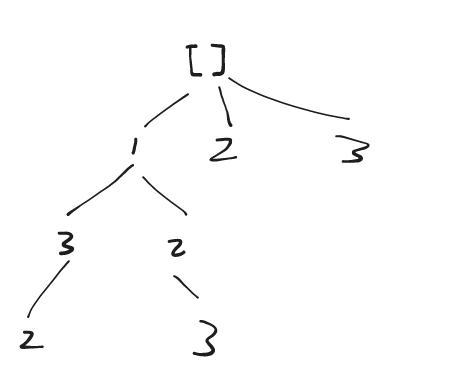

## 题目

[78. 子集](https://leetcode.cn/problems/subsets/)

给你一个整数数组 `nums` ，数组中的元素 **互不相同** 。返回该数组所有可能的子集（幂集）。

解集 **不能** 包含重复的子集。你可以按 **任意顺序** 返回解集。

**示例 1：**

```
输入：nums = [1,2,3]
输出：[[],[1],[2],[1,2],[3],[1,3],[2,3],[1,2,3]]
```

**示例 2：**

```
输入：nums = [0]
输出：[[],[0]]
```

**提示**

- `1 <= nums.length <= 10`
- `-10 <= nums[i] <= 10`
- `nums` 中的所有元素 **互不相同**

## 代码

```java
class Solution {
    public List<List<Integer>> subsets(int[] nums) {
        vis=new boolean[nums.length];
        traverse(nums,0);
        return res;
    }
    
    List<List<Integer>> res = new ArrayList();
    List<Integer> path = new ArrayList();
    boolean[]vis;

    private void traverse(int[]nums,int idx){
        res.add(new ArrayList(path));
        for(int i=idx;i<nums.length;i++){
            if(vis[i]){
                continue;
            }
            vis[i]=true;
            path.add(nums[i]);
            traverse(nums,i+1);
            vis[i]=false;
            path.remove(path.size()-1);
        }
    }
}
```

## 思路



每次 回溯的时候添加 **path** 到 **res** 中

并且在 下一轮 回溯的时候 选择 当前元素的下标 + 1` traverse(nums,i+1);`

最后当 下标 完成的时候, 回溯结束


