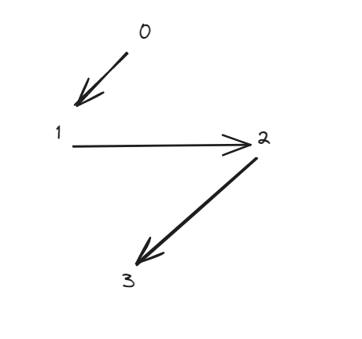

## 题目

[841. 钥匙和房间](https://leetcode.cn/problems/keys-and-rooms/)

有 `n` 个房间，房间按从 `0` 到 `n - 1` 编号。最初，除 `0` 号房间外的其余所有房间都被锁住。你的目标是进入所有的房间。然而，你不能在没有获得钥匙的时候进入锁住的房间。

当你进入一个房间，你可能会在里面找到一套不同的钥匙，每把钥匙上都有对应的房间号，即表示钥匙可以打开的房间。你可以拿上所有钥匙去解锁其他房间。

给你一个数组 `rooms` 其中 `rooms[i]` 是你进入 `i` 号房间可以获得的钥匙集合。如果能进入 **所有** 房间返回 `true`，否则返回 `false`。

 


**示例 1：**

```
输入：rooms = [[1],[2],[3],[]]
输出：true
解释：
我们从 0 号房间开始，拿到钥匙 1。
之后我们去 1 号房间，拿到钥匙 2。
然后我们去 2 号房间，拿到钥匙 3。
最后我们去了 3 号房间。
由于我们能够进入每个房间，我们返回 true。
```

**示例 2：**

```
输入：rooms = [[1,3],[3,0,1],[2],[0]]
输出：false
解释：我们不能进入 2 号房间。
```

 

**提示：**

- `n == rooms.length`
- `2 <= n <= 1000`
- `0 <= rooms[i].length <= 1000`
- `1 <= sum(rooms[i].length) <= 3000`
- `0 <= rooms[i][j] < n`
- 所有 `rooms[i]` 的值 **互不相同**

## 代码

> **力扣的 JDK版本是 12 , 可以放心使用 var 关键字**

### BFS

```java
class Solution {
    public boolean canVisitAllRooms(List<List<Integer>> rooms) {
        // 存储可以进入的节点
        int[]vis = new int[rooms.size()];
        vis[0]=1;
        var num = 0;
        var que = new LinkedList<Integer>();
        que.offer(0);
        while(que.size()!=0){
            var tmp  = que.poll();
            num++;
            for(int node: rooms.get(tmp)){
                if(vis[node]==0){
                    vis[node]=1;
                    que.add(node);
                }
            }
        }
        return num==rooms.size();
    }

}
```

### DFS

```java
class Solution {
    boolean[]vis;
    public boolean canVisitAllRooms(List<List<Integer>> rooms) {
        vis= new boolean[rooms.size()];
        dfs(0,rooms);
        for(boolean b : vis){
            if(!b) return false;
        }
        return true;
    }

    void dfs(int node,List<List<Integer>> rooms){
        if(vis[node]) return;
        vis[node]=true;
        for(int n : rooms.get(node)){
            dfs(n,rooms);
        }
    }
}
```


## 思路

本题 通过每个房间一步一步去拿到钥匙 ,  其实就是 连通图的问题

对于 rooms.get(i) , 我们可以视作 i->item, 的有向图的边 , 其中的节点就是每一个room

对于题目的示例 `rooms = [[1],[2],[3],[]]` , 对应的图如下



我们需要做的就是遍历图,  标记可以到达的节点(room )  , 最后统计出来 是否有没有达到的room即可

---

这里遍历的方式可以采用队列(**BFS**) , 对于每一个节点 , 添加对应的有向图的edge , 并且我们通过vis数组对到达的节点以及访问过的节点进行标记

- vis[i]==0  , 未到达
- vis[i]==1 , 已到达

