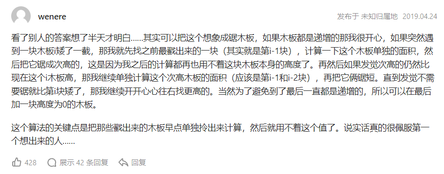
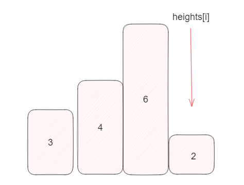

## 题目

[84. 柱状图中最大的矩形](https://leetcode.cn/problems/largest-rectangle-in-histogram/)

给定 *n* 个非负整数，用来表示柱状图中各个柱子的高度。每个柱子彼此相邻，且宽度为 1 。

求在该柱状图中，能够勾勒出来的矩形的最大面积。

**示例 1:**


```
输入：heights = [2,1,5,6,2,3]
输出：10
解释：最大的矩形为图中红色区域，面积为 10
```

**示例 2：**


```
输入： heights = [2,4]
输出： 4
```

**提示：**

- `1 <= heights.length <=105`
- `0 <= heights[i] <= 104`

## 代码

```go
func largestRectangleArea(h []int) (res int) {
	length := len(h)
	if length == 0 {
		return 0
	} else if length == 1 {
		return h[0]
	}
	st := make([]int, len(h))
	newH := make([]int, len(h)+2)
	newH[0] = 0
	newH[length+1] = 0
	copy(newH[1:], h)
	h = newH
	st = append(st, 0)
	for i := 1; i < len(h); i++ {
		//遇到了递减的, 逐渐 "锯木板" 开始计算最大的面积(计算前一个比当前高度高的item的高度 : 统计宽度)
		for len(st) > 1 && h[i] < h[st[len(st)-1]] {
            // 先出栈再计算高度
			height := h[st[len(st)-1]]
			st = st[:len(st)-1]
			wide := i - st[len(st)-1] - 1
			res = max(res, height*wide)
		}
		st = append(st, i)
	}
	return
}

func max(a, b int) int {
	if a > b {
		return a
	}
	return b
}
```

## 思路

**单调栈**

锯木板的想法...



类似的思路 ,  维护一个**单调栈** (栈中存储递增的矩形的**index**) , 当遇到了新的递减的` heights[i]` 我们就进行计算 , 计算的对象是 **单调栈中的栈顶元素**,  由此可以注意到一个细节

在计算wide 的时候我们不能单纯的把前一个 元素 当前 `heights[i-1]` , 因为可能存在 **由一个 heights[i] 来计算前面多个高度的面积**的情况 , 比如



在当前的情况下我们可以依次计算高度为 `6 4 3` 的矩形的面积

那么矩形面积为

```java
height = heights[stack.peekLast()]
stack.pop() // 注意需要先弹出当前的元素
wide = i - stack.peekLast() -1 ;
curSize = height * wide 
```

从上面的代码可以注意我们在 弹出元素之后又调用` stack.peekLast()`

接着引入**哨兵** 的作用 

由于我们的计算面积的方法**只有在出现 递减的元素 才能执行** , 因此我们可以在 heights 的末尾添加一个高度为0 的元素 , 使得 计算高度的必定执行 ， 这是其中一个哨兵.

另一个哨兵位于 队头 ,  前面我们在弹出元素之后又调用了 `stack.peekLast()` , 如果当前stack只有一个元素那么就会导致此时无法计算当前元素的面积 , 因此我们需要在开头加上一个 高度为0的元素（哨兵） 。

