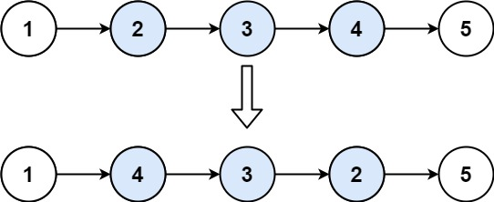

## 题目

[92. 反转链表 II](https://leetcode.cn/problems/reverse-linked-list-ii/)

[labuladong 题解](https://labuladong.github.io/article/slug.html?slug=reverse-linked-list-ii)[思路](https://leetcode.cn/problems/reverse-linked-list-ii/description/#)


中等


1.7K


相关企业

给你单链表的头指针 `head` 和两个整数 `left` 和 `right` ，其中 `left <= right` 。请你反转从位置 `left` 到位置 `right` 的链表节点，返回 **反转后的链表** 。

 

**示例 1：**



```
输入：head = [1,2,3,4,5], left = 2, right = 4
输出：[1,4,3,2,5]
```

**示例 2：**

```
输入：head = [5], left = 1, right = 1
输出：[5]
```

 

**提示：**

- 链表中节点数目为 `n`
- `1 <= n <= 500`
- `-500 <= Node.val <= 500`
- `1 <= left <= right <= n`

 

**进阶：** 你可以使用一趟扫描完成反转吗？


## 代码


```java
class Solution {
    public ListNode reverseBetween(ListNode head, int left, int right) {
        if(left==1){
            return reverseN(head,right-left+1);
        }
        head.next=reverseBetween(head.next,left-1,right-1);
        return head;
    }


    ListNode last = null; // 剩余的不用反转的部分的头结点
    // 反转以 cur 为起点的 n 个节点，返回新的头结点
    ListNode reverseN(ListNode cur, int n) {
        if (n == 1) {
            last = cur.next;
            return cur;
        }
        // 以 cur.next 为起点，需要反转前 n - 1 个节点
        ListNode newHead = reverseN(cur.next, n - 1);
        // 改变指向
        cur.next.next = cur;
        // 让反转之后的 cur 节点和后面的节点连起来
        cur.next = last;
        return newHead;
    }
}
```

## 思路

### 递归

我们首先遍历节点找到需要反转的部分的节点 , 接着定义reverseN方法, 反转以cur节点之后的N个节点

关于递归方法 , 我们需要做的事

1. 更改当前节点的指向
2. 连接之后的不需要反转的部分
3. 防止新的头结点

