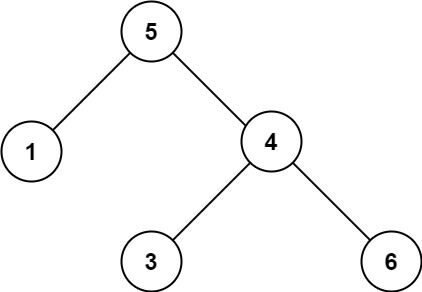

## 题目

[98. 验证二叉搜索树](https://leetcode.cn/problems/validate-binary-search-tree/)

给你一个二叉树的根节点 `root` ，判断其是否是一个有效的二叉搜索树。

**有效** 二叉搜索树定义如下：

- 节点的左子树只包含 **小于** 当前节点的数。
- 节点的右子树只包含 **大于** 当前节点的数。
- 所有左子树和右子树自身必须也是二叉搜索树。

 

**示例 1：**


```
输入：root = [2,1,3]
输出：true
```

**示例 2：**



```
输入：root = [5,1,4,null,null,3,6]
输出：false
解释：根节点的值是 5 ，但是右子节点的值是 4 。
```

 

**提示：**

- 树中节点数目范围在`[1, 104]` 内
- `-231 <= Node.val <= 231 - 1`

## 代码

```java
class Solution {

    TreeNode pre = null;
    boolean res= true;
    // 二叉搜索树的中序遍历是有序数组
    public boolean isValidBST(TreeNode root) {
        dfs(root);
        return res;
    }
    private void dfs(TreeNode root){
        if(root==null || res==false) return;
        dfs(root.left);
        if(root.val<=pre && pre!=null){
            res = false;
            return ;
        }
        pre=root;
        dfs(root.right);
    }
}
```

## 思路

二叉搜索树的中序遍历是 有序的序列, 因此我们通过中序遍历, 然后 维护前置节点的引用即可。