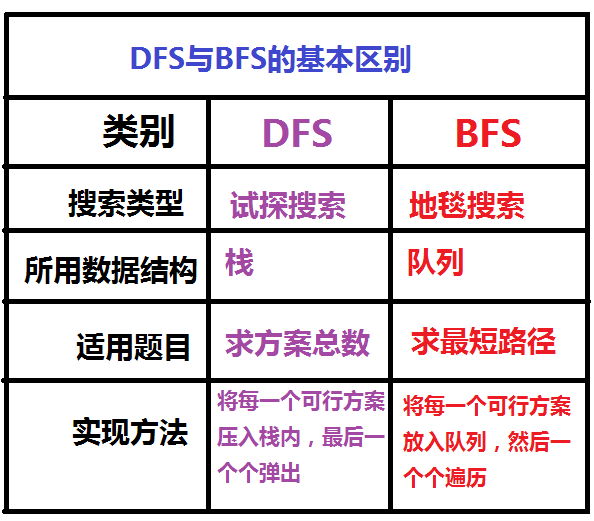
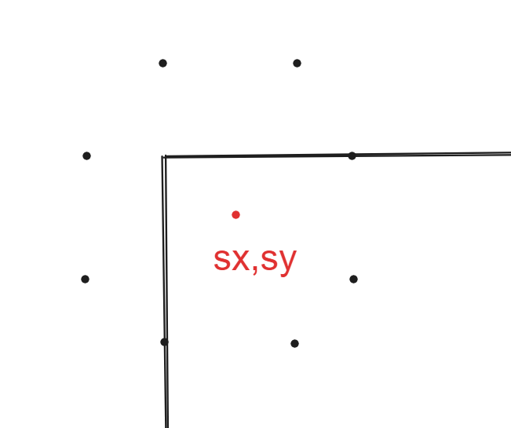

## 题目

https://www.luogu.com.cn/problem/P1443

### 题目描述

有一个 �×�*n*×*m* 的棋盘，在某个点 (�,�)(*x*,*y*) 上有一个马，要求你计算出马到达棋盘上任意一个点最少要走几步。

### 输入格式

输入只有一行四个整数，分别为 �,�,�,�*n*,*m*,*x*,*y*。

### 输出格式

一个 �×�*n*×*m* 的矩阵，代表马到达某个点最少要走几步（不能到达则输出 −1−1）。

### 输入输出样例

**输入 #1**复制

```
3 3 1 1
```

**输出 #1**复制

```
0    3    2    
3    -1   1    
2    1    4    
```

### 说明/提示

#### 数据规模与约定


## 代码

```java
import java.io.*;
import java.util.*;

public class Main {
    static Scanner in = new Scanner(new BufferedInputStream(System.in));//输入
    static PrintWriter out = new PrintWriter(new BufferedOutputStream(System.out));//输出


    static int[] x = new int[]{1, 2, 2, 1, -1, -2, -2, -1};
    static int[] y = new int[]{-2, -1, 1, 2, 2, 1, -1, -2};

    static class Point {
        public int x, y, steps;

        Point(int x, int y, int s) {
            this.x = x;
            this.y = y;
            this.steps = s;
        }
    }

    static int n, m, sx, sy;
    private static final int N = 501;
    static int[][] res = new int[N][N];

    static {
        for (int[] re : res) {
            Arrays.fill(re, -1);
        }
    }

    public static void main(String[] args) throws IOException {
        try {
            n = in.nextInt();
            m = in.nextInt();
            sx = in.nextInt();
            sy = in.nextInt();
            // BFS
            res[sx][sy] = 0;
            LinkedList<Point> que = new LinkedList<>();
            Point point = new Point(sx, sy, 0);
            que.add(point);
            // 只要还有可以走的点那么就一直走下去
            while (que.size() != 0) {
                Point p = que.poll();
                for (int i = 0; i <= 7; i++) {
                    int nx = p.x + x[i];
                    int ny = p.y + y[i];
                    if (nx > 0 && ny > 0 && nx <= n && ny <= m && res[nx][ny] == -1) {
                        res[nx][ny] = p.steps + 1;
                        que.addLast(new Point(nx, ny, res[nx][ny]));
                    }
                }
            }
            // print
            for (int i = 1; i <= n; i++) {
                for (int j = 1; j <= m; j++) {
                    System.out.printf("%-5d", res[i][j]);
                }
                System.out.println();
            }
        } finally {
            in.close();
            out.close();//关流，不然有些数据还在缓冲区
        }
    }
}
```


## 思路

非常经典的BFS题目 (题目要求最短路径), 



首先需要明确的一点是   ***马走田***

其次是 , 注意题目的数据范围, 习惯性我们的数组通常是从0开始记录索引 , 但是题目的 n m sx sy是从1开始

---

对于起始点sx sy , 我们从起始点出发,  每次的遍历得到的结果是  该点(可以是一个或者多个,  具体看当前的queue的状态)可以到达所有点 , 接着把这些点纳入到下一轮的遍历中, 直到队列中没有元素,  我们就可以退出遍历

上面这句话翻译成代码就是下面的样子---

```java
for (int i = 0; i <= 7; i++) {
    int nx = p.x + x[i];
    int ny = p.y + y[i];
    if (nx > 0 && ny > 0 && nx <= n && ny <= m && res[nx][ny] == -1) {
        res[nx][ny] = p.steps + 1;
        que.addLast(new Point(nx, ny, res[nx][ny]));
    }
}
```

其实x , y 数组是 **马走日**确定的数组



为了方便打印最后无法到达的点为 -1 , 我们初始化数组为 -1 即可。

关于最短路径 ， 由于我们采用BFS ，<u>**每个点在第一次被遍历到的时候 ， 就是从起始点到这个点的最短路径**</u> ， 因此直接

`res[nx][ny] = p.steps + 1;` **即可**

**<u>注意最后关闭输入流和输出流!!!!!</u>**