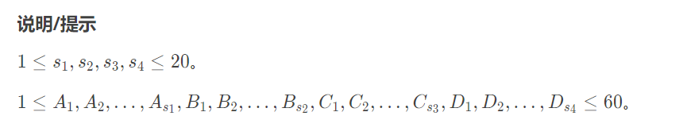

## 题目

kkksc03考前临时抱佛脚

### 题目背景

kkksc03 的大学生活非常的颓废，平时根本不学习。但是，临近期末考试，他必须要开始抱佛脚，以求不挂科。

### 题目描述

这次期末考试，kkksc03 需要考 $4$ 科。因此要开始刷习题集，每科都有一个习题集，分别有 $s_1,s_2,s_3,s_4$ 道题目，完成每道题目需要一些时间，可能不等（$A_1,A_2,\ldots,A_{s_1}$，$B_1,B_2,\ldots,B_{s_2}$，$C_1,C_2,\ldots,C_{s_3}$，$D_1,D_2,\ldots,D_{s_4}$）。


kkksc03 有一个能力，他的左右两个大脑可以同时计算 $2$ 道不同的题目，但是仅限于同一科。因此，kkksc03 必须一科一科的复习。


由于 kkksc03 还急着去处理洛谷的 bug，因此他希望尽快把事情做完，所以他希望知道能够完成复习的最短时间。

### 输入格式

本题包含 $5$ 行数据：第 $1$ 行，为四个正整数 $s_1,s_2,s_3,s_4$。

第 $2$ 行，为 $A_1,A_2,\ldots,A_{s_1}$ 共 $s_1$ 个数，表示第一科习题集每道题目所消耗的时间。

第 $3$ 行，为 $B_1,B_2,\ldots,B_{s_2}$ 共 $s_2$ 个数。

第 $4$ 行，为 $C_1,C_2,\ldots,C_{s_3}$ 共 $s_3$ 个数。

第 $5$ 行，为 $D_1,D_2,\ldots,D_{s_4}$ 共 $s_4$ 个数，意思均同上。

### 输出格式

输出一行,为复习完毕最短时间。

### 样例 #1

#### 样例输入 #1

```
1 2 1 3		
5
4 3
6
2 4 3
```

#### 样例输出 #1

```
20
```

### 提示



## 代码

```java
import java.io.*;
import java.util.Scanner;

public class Main {
    static Scanner in = new Scanner(new BufferedInputStream(System.in));//输入
    static PrintWriter out = new PrintWriter(new BufferedOutputStream(System.out));//输出

    static int l, r, min, res;
    static int[] s = new int[5];
    static int[][] a = new int[21][5];

    static void search(int idx, int sIdx) {
        if (idx >= s[sIdx]) { // 当前科目遍历完毕
            min = Math.min(min, Math.max(l, r));
            return;
        }
        l+=a[idx][sIdx];
        search(idx+1,sIdx);
        l-=a[idx][sIdx];
        r+=a[idx][sIdx];
        search(idx+1,sIdx);
        r-=a[idx][sIdx];
    }

    public static void main(String[] args) throws IOException {
        for (int i = 0; i < 4; i++) {
            s[i] = in.nextInt();
        }
        for (int i = 0; i < 4; i++) {
            l = r = 0;
            min = Integer.MAX_VALUE;
            for (int j = 0; j < s[i]; j++) {
                a[j][i] = in.nextInt();
            }
            search(0, i);
            res += min;
        }
        out.println(res);
        in.close();
        out.close();//关流，不然有些数据还在缓冲区
    }
}
```


## 思路

暴力搜索

<u>尝试每一种做法  , 在遍历完的时候维护最小值</u> 


